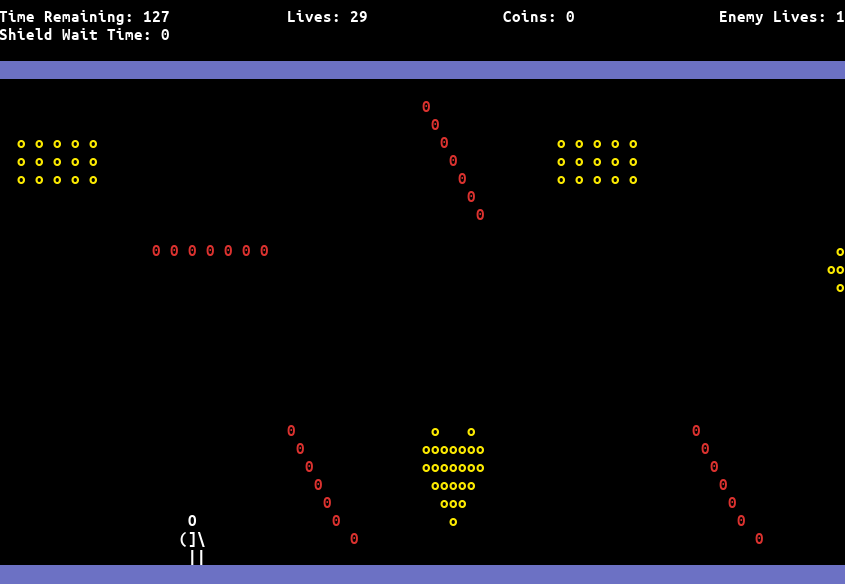
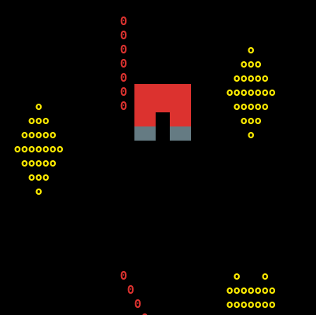
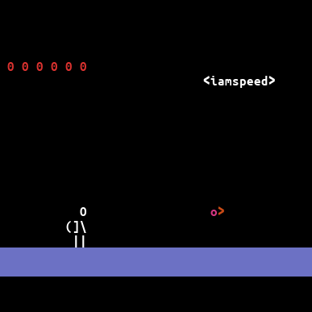
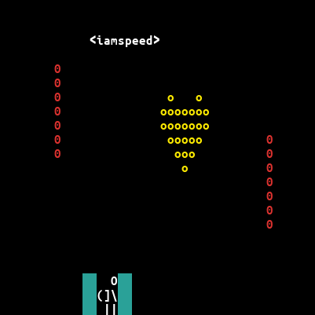
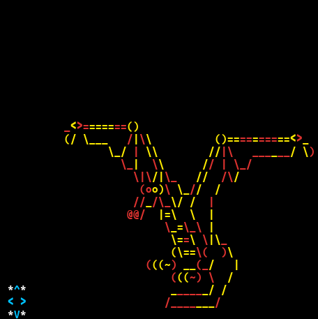
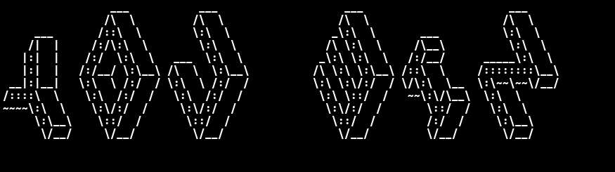

# The-Mandalorian
An arcade game in Python3 (terminal-based), heavily inspired by Jetpack Joyride where the user will control the mandalorian, move it up, forward and backward, while collecting coins and fighting/dodging its enemies on the way. 



## Getting Started 

```bash
> git clone https://github.com/JyotiSunkara/The-Mandalorian.git
> cd The-Mandalorian
> python3 game.py
```

## Functionality Implemented

### Gravity

Players falls down with increasing velocity when in air.

### Magnet

Attracts the player in both X and Y directions.




### Speed Powerup

`iamspeed` powerup available to increases the speed of movement in the game.

### Bullets

Bullets can destoy the lasers in their path.




## - Shield 

Green shield helps the player move through lasers with no damage.




### Sounds

Gameplay, coin collection, collision with lasers, enabling the shield and the ice balls by the dragon enemy, game win and loss all have unique and different sounds in the game!

### Dragon Enemy 

Smart dragon enemy shoots ice balls at the players position. 




### Randomised Lasers

Three types of lasers: Vertical, Horizontal and Angled are placed in the path of the player.

### Randomized Coins 

Clumps of coins in the players path increase the players score when collected.

## Controls

### `D`: Move Right

### `A`: Move Left

### `W`: Fly up

### `S`: Shoot

### `Space Bar`: Enable shield

### `Q`: Quit




